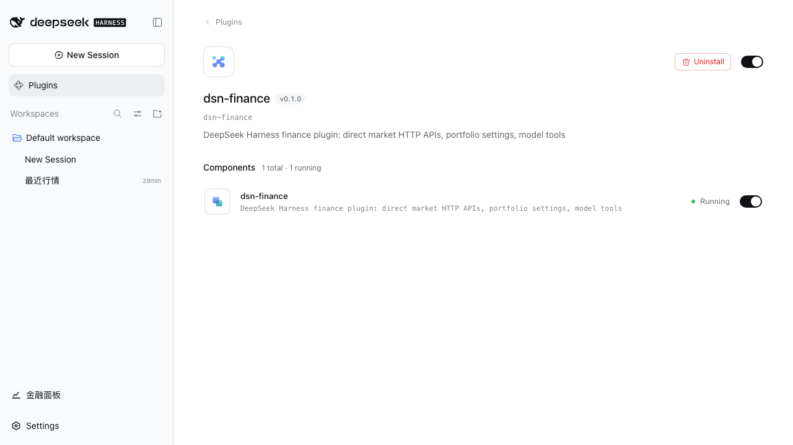
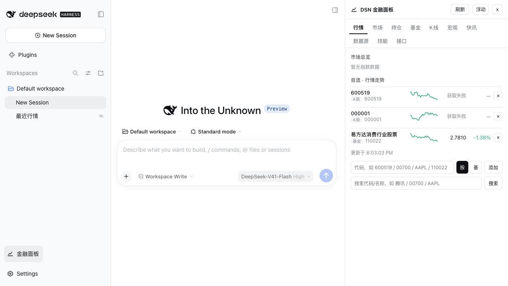
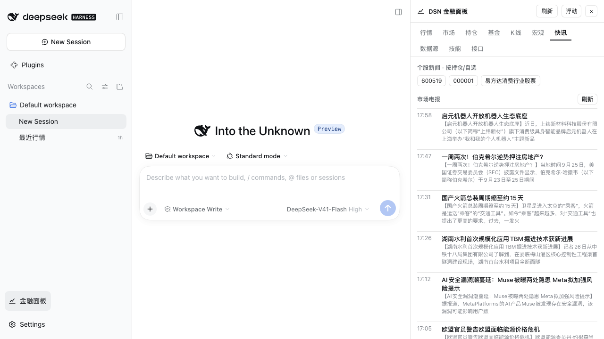
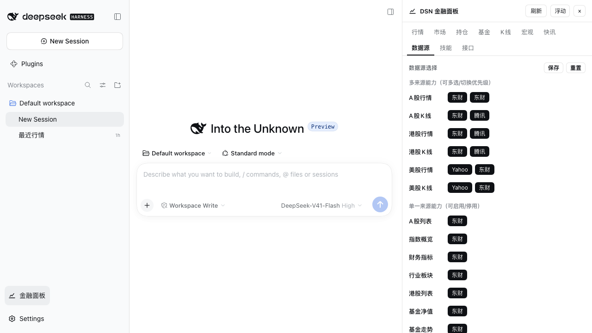
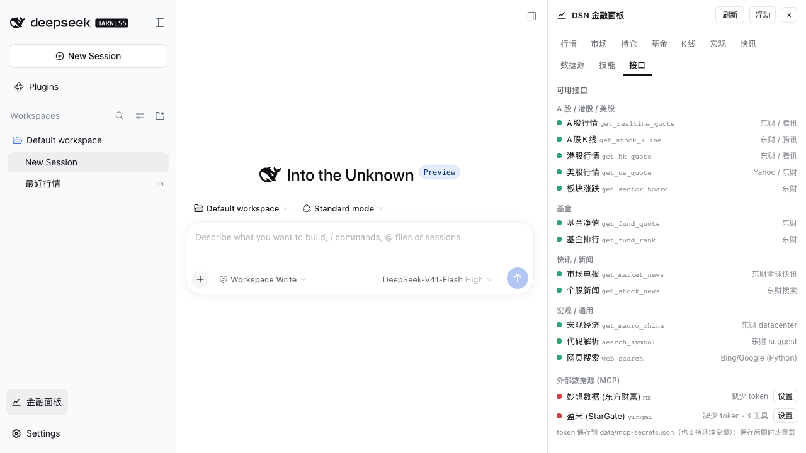
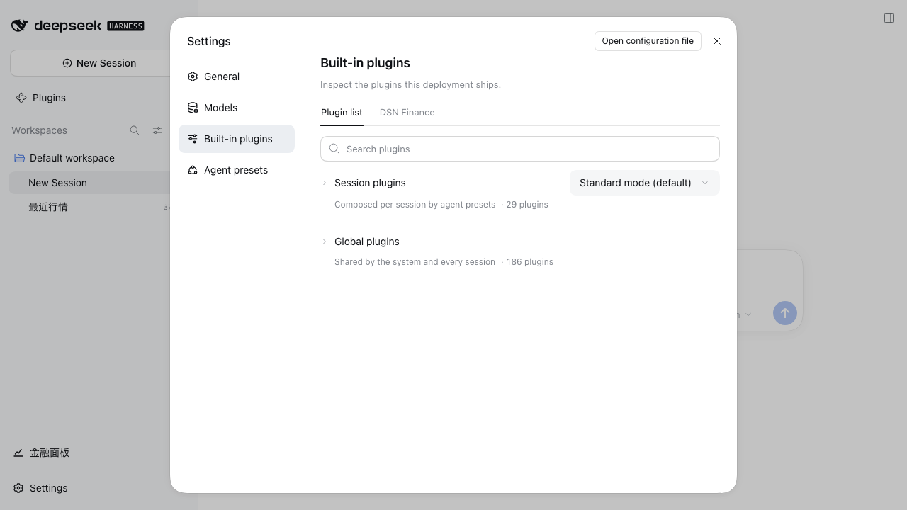
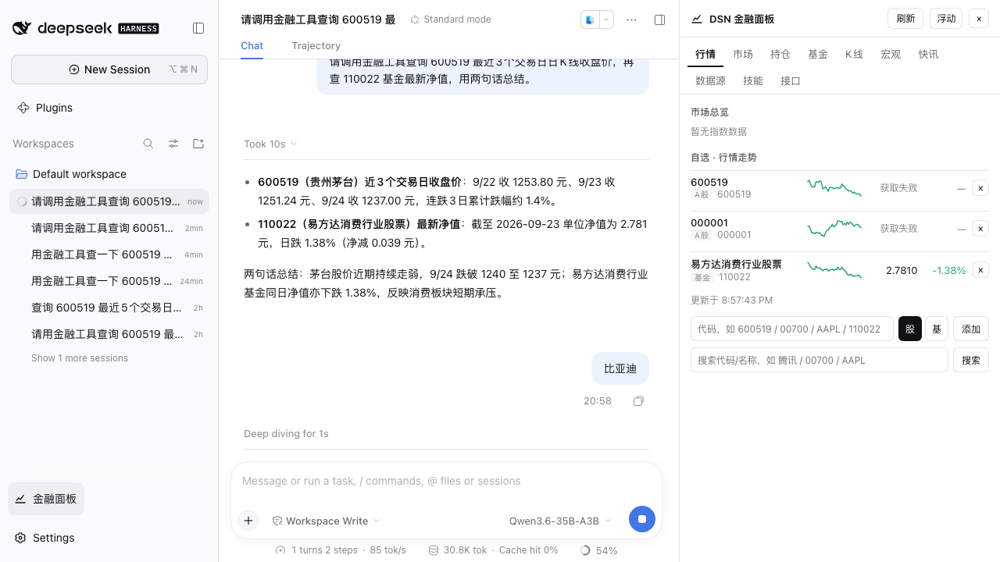
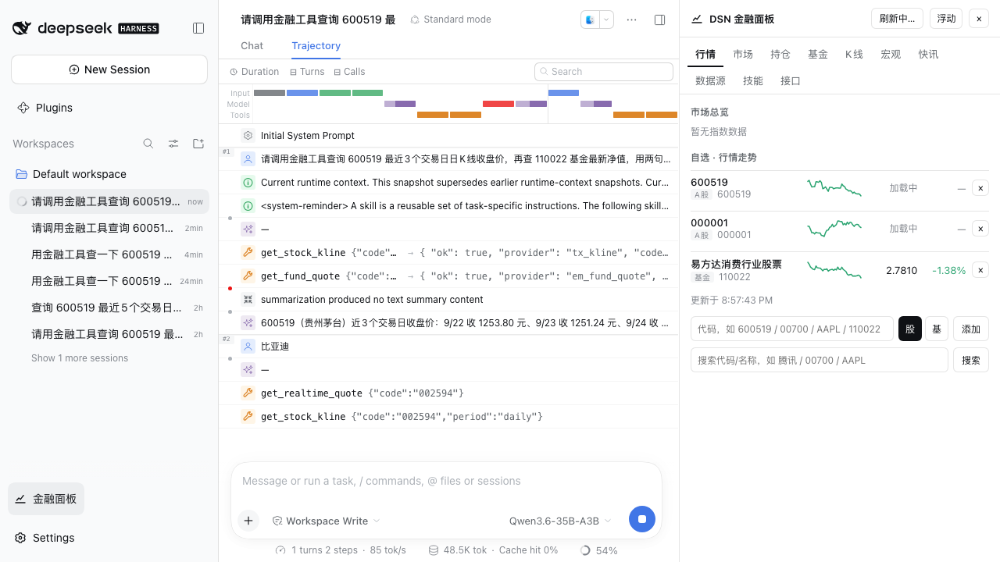

# 升级 DSH 0.1.7-rc.2：适配与验证记录

环境：macOS arm64 · Node 24.14.0 · pnpm 11.24.0 · 独立 `DSH_HOME=.dsh-verify`（2026-09-26）

## 1. 升级范围

| 项目 | 升级前 | 升级后 |
| --- | --- | --- |
| `deepseek-harness` 源码 | `master` @ `cd5ef814`（0.1.2-alpha.1） | fast-forward 到 `origin/master` @ `477b4f42`（tag `dsh-v0.1.7-rc.2`） |
| 插件依赖 `@deepseek-ai/dsh*` | `^0.1.0-rc.7` | `^0.1.7-rc.2`（peer 声明 `>=0.1.7-rc.2`） |
| `@deepseek-ai/cordis` | 4.0.1 | 4.0.4 |
| `@deepseek-ai/schemastery` | 3.18.1 | 3.18.4 |
| `@deepseek-ai/dsh-code-runtime` | 依赖项 | 已改名 `@deepseek-ai/dsh-ptc-runtime`，依赖同步替换 |

## 2. 破坏性变更与适配

| # | 0.1.7 契约 | 原实现 | 适配后 |
| --- | --- | --- | --- |
| 1 | `@deepseek-ai/dsh-settings` 不再导出 `installSettingsSection` / `settingsNamespace`；配置归 profile 条目所有，且**只有 `volatile` 字段**进入宿主配置表单（`volatileForm` / `isVolatilePath`） | 插件自建 settings 段并暴露整份 Config | 删除该调用；`panelOpen` / `panelDocked` 在 Config schema 中声明 `Schema.boolean().volatile()`，其余字段保持普通组合配置 |
| 2 | 客户端设置服务由 `settingsScope.bind({namespace})` 变为 `ctx.configForms.get(entryId)` | `inject: ['slots','settingsScope']` | `inject: ['slots','configForms']` + `ctx.configForms.get('dsn-finance')` |
| 3 | 客户端插槽 `settings.plugin.item` 移除，改为 `settings.plugins.tab`（Plugins 设置页的功能标签页） | 注册一张插件设置卡 | 注册 `settings.plugins.tab`（`id: 'dsn-finance'`、`label: 'DSN Finance'`） |
| 4 | `JsonValue` 从 `dsh-tools` 迁至 `@deepseek-ai/dsh-util-values` | `import { type JsonValue } from '@deepseek-ai/dsh-tools'` | 改从 `@deepseek-ai/dsh-util-values` 导入（`tools/register.ts`、`mcp/manager.ts`、`history/tools.ts`） |
| 5 | 客户端 roster 以包名做行 id，`dsh.client.inject` 即组合边 | 仅 inject `…-ui-settings-plugins` | 补齐 `…-ui-settings`（提供 `configForms`）与 `…-ui-sidebar`（foot 座位宿主） |
| 6 | 本地安装必须是**完整的 dsh 安装**：服务定义包（`dsh-jobs`、`dsh-attachment`、`dsh-session-persistence`…）以实现包的 peer 形式发布 | `.npmrc` 设 `legacy-peer-deps=true`，npm 跳过 peer | `.npmrc` 改为显式 `legacy-peer-deps=false`；否则 profile 条目全部 `failed to import` |
| 7 | `dsh` CLI 入口依赖 `import.meta.main` | 文档写 Node `>=20` | 记录并校验 Node `^22.19` / `>=24.2`；24.0/24.1 会让 CLI 静默退出（本机 24.1.0 命中） |
| 8 | `dsh plugin` 在 profile 目录执行 **pnpm**，并把包追加进 `dsh.profile.bundles` | 脚本手工写 profile `package.json` + `ln -s` | `dev_web.sh` / `restart_web.sh` 改走 `dsh plugin --profile web add <dir>`，并加 Node 能力探测与报错 |

## 3. 验证证据（全部实测）

**构建**：`npm run build` → `tsc` 无错误 + 客户端 bundle `lib/client/wrapped-bundle.js`（467 KB）。

**profile 组合**：`dsh --profile web --dump-config`

```yaml
# == @deepseek-ai/dsh-base, patched by dsn-finance
- id: web
  config:
    searchProvider: dsn-web-search
...
# == dsn-finance
- id: dsn-finance
  name: dsn-finance
```

**宿主启动**：`dsh web --host 127.0.0.1 --port 3080` 无启动失败；插件管理器显示 `dsn-finance v0.1.0`，组件 `1 running`。



**客户端 roster**：首页 `window.__DSH_BOOT__` 含

```json
{"id":"dsn-finance","url":"plugins/??dsn-finance/client.js&rev=ed6e51904a70",
 "inject":["@deepseek-ai/dsh-client-ui-settings","@deepseek-ai/dsh-client-ui-settings-plugins","@deepseek-ai/dsh-client-ui-sidebar"]}
```

bundle 可取：`GET /plugins/??dsn-finance/client.js&rev=…` → 200 / 467309 B，内容为 `window.__ModuleLoader__.load({id:"dsn-finance",…})`。

**宿主 API**（HTTP 实测，非 mock）：

| 路由 | 结果 |
| --- | --- |
| `GET /plugins/dsn-finance/api/state` | `holdings: []`、`watchlist: 600519/000001/110022`、`portfolioPath` |
| `GET …/api/live` | 5 条指数（上证 3888.37 −1.22%）、行情快照、9 项 capability 健康 |
| `GET …/api/news` | 25 条市场电报（实时） |
| `GET …/api/macro` | 5 组序列（CPI 最新 2026年08月 0.8%） |
| `GET …/api/fundrank` | 20 行基金排行 |
| `GET …/api/providers`、`/skills`、`/mcp`、`/history/list` | provider 目录、技能目录、MCP token 状态、本地历史库 |

**面板 UI**（dsh 内嵌，非独立页面）：

| 行情 | 快讯 |
| --- | --- |
|  |  |

| 数据源（多源优先级） | 接口（含 MCP） |
| --- | --- |
|  |  |

**设置页适配**：Plugins 设置段出现 `DSN Finance` 标签页。



**偏好写回（volatile 字段闭环）**：点击左下角「金融面板」后，`$DSH_HOME/profiles/web/cordis.patch.yml` 出现

```yaml
- id: dsn-finance
  name: dsn-finance
  config:
    ...
    panelOpen: true
```

重启 dsh web 后面板自动打开（`panelOpen` 从用户层读回），状态跨会话保留。

**数据源可用性**：`npx tsx scripts/test_availability.ts --group ashare` 得 3/9。失败项集中在东财 `push2*.eastmoney.com`（`quote`/`indices`/`sectors`/`stock_list`）；同网络下 `curl` 直连该主机可建连但无响应（软限流），`qt.gtimg.cn`（腾讯）、东财 datacenter / suggest 均正常，`kline` 因此走 `tx_kline` 成功。属公开源限流的环境问题，插件按 capability 降级符合设计。

### 3.1 本地模型端点接入测试

被测端点：`http://29.181.193.119:8080/v1/chat/completions`（OpenAI 兼容，模型 `Qwen3.6-35B-A3B`）。

**端点契约（curl 实测）**

| 检查项 | 结果 |
| --- | --- |
| 非流式 `POST /v1/chat/completions` | 200；`model=Qwen3.6-35B-A3B`；返回含 `reasoning_content`（思考模型，短 `max_tokens` 会出现 `finish_reason=length` 且 `content` 为空） |
| 流式 `stream: true` + `stream_options.include_usage` | 514 个 SSE 事件 + `data: [DONE]`，`usage` 正常 |
| 工具调用（`tools` + `tool_choice: auto`） | `finish_reason=tool_calls`，`function.name`/`arguments` 分片正确 |
| 输出上限 | `max_tokens=32000` → 200；`max_tokens=32400` → 400 `This model supports at most 32384 completion tokens` |

**配置（`$DSH_HOME/profiles/web/cordis.patch.yml`）**

```yaml
- id: llm-pi-ai
  config:
    providers:
      local-qwen:
        displayName: Local Qwen · Qwen3.6-35B-A3B
        api: openai-completions
        baseURL: http://29.181.193.119:8080/v1     # dsh 自行追加 /chat/completions
        apiKeyEnv: LOCAL_QWEN_API_KEY              # 值存 $DSH_HOME/.credentials.yaml 的 refs 段
        compat:
          supportsDeveloperRole: false
          maxTokensField: max_tokens
        defaultContextWindow: 32384
        defaultMaxTokens: 8192
        models:
          - id: Qwen3.6-35B-A3B
            contextWindow: 32384
            maxTokens: 8192
- id: agent-default-model
  config:
    provider: local-qwen
    model: Qwen3.6-35B-A3B
```

**踩坑 1：`baseURL` 是根路径**。pi-ai 的 `openai-completions` 路由会自行拼接 `/chat/completions`，把完整对话地址填进 `baseURL` 会得到 `…/v1/chat/completions/chat/completions`。

**踩坑 2：`maxTokens` 必须给端点留预算**。`maxTokens: 16384`（沿用旧 `settings.yaml` 的值）时，工具回合的第二次请求稳定 400（会话页显示 `CONTEXT_WINDOW_EXCEEDED / 400 status code (no body)`）——该服务端限制 `prompt_tokens + max_tokens ≤ 32384`，而 dsh 的系统提示词 + 工具 schema 本身约 13K token，叠加 16K 输出即越界。改为 `maxTokens: 8192`（留约 24K 给 prompt）后同样的请求 10 秒完成。

**端到端结果**：Web 会话提问“请调用金融工具查询 600519 最近3个交易日日K线收盘价，再查 110022 基金最新净值，用两句话总结。”



轨迹页显示真实工具调用：`get_stock_kline({"code":"600519"}) → {"ok":true,"provider":"tx_kline"…}`、`get_fund_quote({"code":"110022"}) → {"ok":true,"provider":"em_fund_quote"…}`，回合耗时 10 s、2 steps。



## 4. 结论与后续建议

- 适配完成：插件在 dsh 0.1.7-rc.2 下可**加载（宿主 Running）→ 客户端 roster 组合 → 面板渲染 → 数据接口 → 偏好写回 → 模型调用金融工具**全链路可用。
- 可选增强：`quote` 能力目前只有东财 push2 源，限流时无兜底；面板已能展示 kline 迷你图，可考虑加腾讯行情作为 `quote` fallback。
- `scripts/fix_dsh_peers.sh` 是旧流程遗留（硬编码旧机器路径、靠报错逐个补包），新流程由 `.npmrc` + `dsh plugin` 覆盖，可删除。
- 复现方式：`DSH_HOME=<dir> DSH_NODE=<node≥24.2 或 22.19+> bash scripts/restart_web.sh`，浏览器打开输出中的 `?token=` 链接。
